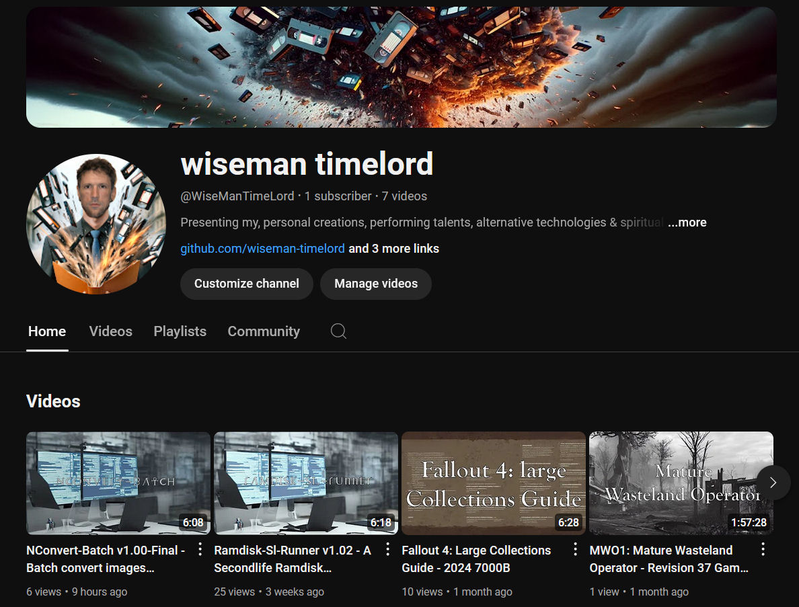

# NConvert-Batch
Status: Working; see release notes.

### Description:
Its a Python Gradio interface for converting ANY image format to ANY imgage format, even rare ones like .pspimage, all made possible through NConvert binary command line tool. The program provides a user-friendly menu to set the source folder, input file format, and desired output format. The scripts ensures efficient and seamless conversion and management of image files, making it a practical tool for users needing to process multiple common format such as `.jpg`, `.bmp`, `.png`, etc, and also less common formats such as`.pspimage`, and vice versa.

### Features:
- **Multiple Formats**: The Gradio interface limited to 10, but they can be edited in the `.py` script. 
- **Interactive Menu**: Utilizing your standard text-based menu for effective configuration.
- **Batch Conversion**: All specified format files in, specified folder and its subfolders, to desired format.
- **Automatic Report**: Provides a summary of the total number of successfully converted files.
- **Deletion Option**: Offers the option to delete original files.
- **Persistent Settings**: Remembers format from/to and target folder.
- **Error Handling**: Displays errors for any files that fail to convert.
- **Bleep On Complete**: Incase for some reasoning it is going to take a while.

### Preview:
- The Video Demonstration on YouTube (for v1.00-Final)...
<br>[](https://www.youtube.com/watch?v=ECydHjJ04U4)
- The NConvert-Batch Gradio WebUi...

- The Batch Launcher (NConvert-Batch.Bat)...
```
========================================================================================================================
    NConvert-Batch
========================================================================================================================


    1. Run NConvert-Batch

    2. Install Requirements


========================================================================================================================
Selection; Menu Options = 1-2, Exit NConvert-Batch = X:
```

## Requirements:
- Windows 7-11 - The batch auto detects if the width of the terminal is 80/120 and displays text appropriately.
- [NConvert](https://www.xnview.com/en/nconvert) - ~500 image formats supported (installed by installer).
- Python 3.9+ - Compatible with, the newer and what are now the older, versions of python.
- Internet - Installer requires internet for install of Python libraries etc.

### Instructions:
1. Run `NConvert-Batch.Bat` by right click `Run as Administrator`, as we are doing, complex recursive file operations under the interface and downloading/unpacking NConvert in the installer.
2. Install Requirements from menu through option `2`, it will run `.\installer.py`, which will install everything you require via direct links/pip. 
3. After requirements are installed, then run `NConvert-Batch` from `1.` on the batch menu, and if the gradio interface does not pop-up in the default browser, then right click the server address and then click open.. 
4. Configure the settings in the browser interface, if your file format preference is not in the list, then edit relevant lists in python script by replace appropriate extension text.
7. When all setting are correct, then 1st ensure you noticed the `Delete Original Files?` tickbox, and if you did, then click `Start Conversion`, and it will convert the files, as  you have specified, over-writing as it goes.
8. Check the image folders, I saved you hours of work, now isnt that worth a little donation.

### NOTATION:
- De-Confustion... Meaning 1: "Batch" - a `*.bat` Windows Batch file. Meaning 2: "Batch" - Repetitive actions done together in sequence.
- If you want others among the ~500 possible formats, then you will need to manually edit the top of ".\launcher.py".
- Thanks to, DeepSeek v2.5-v3 and GPT-4o and Claudev4 and Grok and Qwen3-Max, for assistance in programming. 
- Thanks to [XnView Software](https://www.xnview.com/en/) for, creating and hosting, [NConvert](https://www.xnview.com/en/nconvert/), the binary behind my frontend.
- NConvert-Batch is the Windows version of [NConvert-Bash](https://github.com/wiseman-timelord/NConvert-Bash).
- A slideshow window for after conversion was attempted in, Qwen3-Max and Grok, but both failed, the idea was to temp copy converted files to `.\temp\preview`.

## DISCLAIMER:
This software is subject to the terms in License.Txt, covering usage, distribution, and modifications. For full details on your rights and obligations, refer to License.Txt.
NConvert is not made by Wiseman-Timelord, only the, Gradio Interface and Batch Launcher/Installer, is; Terms and Conditions, for NConvert still apply.
